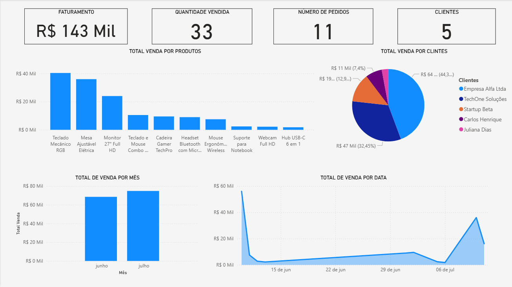

# Projeto Tech4Work - Automação e Análise de Dados

Este projeto demonstra um pipeline de dados completo para a startup Tech4Work, integrando automações avançadas em SQL com tratamento de dados em Python.

## 🛠️ Automações SQL (MySQL)

### Camadas de Triggers para Controle de Estoque
Implementei duas triggers para garantir a integridade absoluta do inventário:
* **`trigger_estoque_direto.sql`**: Sincroniza o estoque imediatamente após cada inserção na tabela de vendas.
* **`trigger_estoque_itens_condicional.sql`**: Utiliza lógica condicional (`IF`) para validar o tipo do item antes da baixa, garantindo que apenas 'produtos' afetem o saldo.

### Stored Procedure de Alta Complexidade
* **`procedure_registro_venda_kit.sql`**: Gerencia a venda de produtos compostos. Utiliza um **Cursor** para iterar sobre os componentes de um kit, realizando a baixa individual de cada item no estoque de forma automatizada.

## 🐍 Pipeline ETL (Python)
* **`main_etl_process.py`**: Script que realiza a extração do banco MySQL, limpeza de dados com **Pandas** e gera o arquivo `vw_resumo_vendas.csv` para análise executiva.

## 📊 Visualização de Dados (Power BI)

O output final do pipeline é um dashboard estratégico que permite acompanhar o desempenho comercial da startup em tempo real.

### Principais Insights do Painel:
* **Faturamento Total:** R$ 143 Mil consolidados.
* **Top Products:** Identificação clara de que Teclados Mecânicos e Mesas Ajustáveis lideram as vendas.
* **Análise de Clientes:** Distribuição percentual de faturamento por carteira de clientes.
* **Tendência Temporal:** Gráficos de linha mostrando a evolução das vendas dia a dia.

## 📊 Tecnologias
MySQL (Procedures, Triggers, Cursors), Python (Pandas, SQLAlchemy), Business Intelligence.
